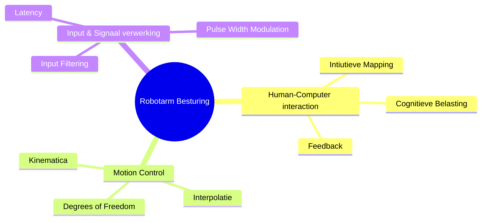

 
# Politie - 3e jaars stage <!-- omit in toc -->
| Onderwerp | Opmerking |
|---------------|---------------------|
| *Student* | Rick van der Voort |
| *Studentnr* | 1855264|
| *Bedrijf* | Politie Nederland |
| *Begeleider* | Paul Otte |
| | Innovatie Manager Robotica |
| | paul.otte@politie.nl |
| | +31618669968 |
| *Datum* | 17-02-2026 |
| *Versie* | 1.0 |

# Inhoudsopgave

- [Inhoudsopgave](#inhoudsopgave)
- [Inleiding](#inleiding)
  - [Organisatorische context](#organisatorische-context)
  - [Kwestie](#kwestie)
  - [Doel](#doel)
  - [Afbakening](#afbakening)
  - [Onderzoeksvragen](#onderzoeksvragen)
  - [Producten](#producten)
  - [Leerdoelen](#leerdoelen)
  - [Randvoorwaarden](#randvoorwaarden)
- [Vooronderzoek](#vooronderzoek)
- [Aanpak](#aanpak)
  - [Inleiding](#inleiding-1)
  - [Methoden](#methoden)
- [Risico’s](#risicos)
- [Planning en communicatie](#planning-en-communicatie)
  - [Fasering activiteiten](#fasering-activiteiten)
  - [Benodigde mensen en middelen opdrachtgever](#benodigde-mensen-en-middelen-opdrachtgever)
  - [Communicatie](#communicatie)
- [Aantonen leeruitkomsten](#aantonen-leeruitkomsten)
- [Ethische afwegingen](#ethische-afwegingen)
- [SDG afwegingskader](#sdg-afwegingskader)

# Inleiding

In enkele zinnen zoom je van de missie en visie van de organisatie in op het probleem en geef je heel kort een indruk van wat komen gaat. Daarmee zet je de toon. Kort, krachtig en uitnodigend om verder te lezen. Vaak wordt de inleiding als laatste onderdeel van je verslag geschreven.

<u>Voorbeeld:</u>  
(Bedrijf) maakt zich sterk voor een veilig, leefbaar en bereikbaar Nederland. Dat blijkt heel concreet uit de pilot … op de afdeling … waarmee (Bedrijf) met relatief beperkte maatregelen veel bijdraagt aan de verkeersveiligheid. Bij de uitvoering van de pilot bleek dat de huidige ICT-infrastructuur niet goed aansluit op het beoogde …proces. Met name … bleek het belangrijkste knelpunt. Het doel van deze opdracht is om … (Jan-Willem Lankhaar, 2024)

## Organisatorische context

De Politie Nederland is een van de grootste overheidsorganisaties van het land, met een personeelsbestand van bijna 63.000 medewerkers die zich dagelijks inzetten voor de veiligheid in de samenleving. De kerntaak van de organisatie is wettelijk verankerd in het handhaven van de rechtsorde en het verlenen van hulp aan burgers in nood. Daarnaast speeld de politie een cruciale rol in het opsporen van strafbare feiten en het voorkomen van criminaliteit. De student is aan het werk in het Pre-Development Team, waar ze concepten tot werkelijkheid maken om te kijken of het echt iets waard is voor de Politie. Het team heeft al aan meerdere grotere projecten gewerkt, bijvoorbeeld het bedenken en opzetten van de MONO-Cam. De student zal in dit team aan een robot-arm werken en onderzoek voor doen, en is daar verantwoordelijk voor om het op te leveren. De robot-arm waar de student aan werkt kan toegevoegd worden aan onderdelen waar andere studenten aan werken, bijvoorbeeld de bestuurbare robot auto.

## Kwestie

De Politie moet tijdens een operatie soms een baken plaatsen op een voertuig, of kijken of er verdacht object onder een voertuig zit en verwijderen. Hiervoor moet een agent fysiek naar de voertuig toe wat opvallen is of zelfs gevaarlijk. Als een crimineel dan een agent ziet aankomen kan diegen snel wegrijden en is hij niet meer te traceren wanneer er geen baken op zit.

hiervoor heeft het pre-development team een robot-arm die is ontwikkeld door een oud stagiair. Echter kan die nu niet aangestuurd worden en dus niet in gebruik genomen worden. Hierdoor zullen er altijd nog momenten zijn dat een operator dus niet een baken kan plaatsen, wat dus duizenden euro's aan schade kan veroorzaken of een crimineel die niet meer te traceren is.

## Doel

Op 29 juni leverd de student een werkende Proof of Concept van de robotarm en de bijbehorende technische documentatie op .
Het doel is behaald wanneer de robotarm in staat is om via de remote controller een bewegingstraject naar specifieke coördinaten uit te voeren zonder mechanische haperingen. De doelstelling is definitief gehaald wanneer de stagebegeleider het eindproduct goedkeurt op basis van een demonstratie van deze vloeiende beweging en de gebruiksvriendelijkheid.

Samen met de paragraaf Afbakening is deze paragraaf heel belangrijk voor het vaststellen van de juiste verwachtingen.

## Afbakening

Alle test worden uitgevoerd op kantoor of testlocaties van de politie. De student zal alleen werkzaam zijn voor het Pre-Development team en daar werken aan alleen het robot-arm project tot uiterlijk 29-06-2026. De student zal minimaal een MVP aan aansturings code opleveren waar externe software op aangesloten kan worden. De student zal niet aan andere projecten werken buiten de robot-arm om.

## Onderzoeksvragen

Het doel van dit project is om een brug te slaan tussen de menselijke bediening en de technische uitvoering van een robotarm. Voor de Politie is het essentieel dat de besturing niet alleen technisch werkt, maar ook natuurlijk aanvoelt voor de operator die het apparaat bedient. Om focus aan het onderzoek en de ontwikkeling te geven, is de volgende hoofdvraag opgesteld:

    Hoe kan een besturingssysteem voor een robotarm worden ontworpen en gerealiseerd dat zorgt voor een intuïtieve gebruikerservaring en een vloeiende bewegingsuitvoering via een fysieke remote controller?

Deze vraag combineert de twee belangrijkste eisen van de opdrachtgever: de intuïtieve gebruikerservaring (het "gemakkelijk en natuurlijk" gebruiken) en de vloeiende bewegingsuitvoering (het technisch correct en schokvrij bewegen).
Deelvragen

Omdat de hoofdvraag te complex is om in één stap te beantwoorden, is het project opgedeeld in vier fasen. Elke fase heeft een eigen deelvraag die leidt tot een specifiek eindproduct of onderzoeksresultaat. Deze structuur volgt de logische cyclus van softwareontwikkeling:

Allereerst moet duidelijk worden wat "natuurlijk bewegen" precies inhoudt voor de eindgebruiker en welke technische randvoorwaarden er zijn.

    Welke functionele en technische eisen worden gesteld aan de aansturing van de robotarm om deze 'natuurlijk' te laten aanvoelen voor de eindgebruiker?

Vervolgens wordt gekeken naar de architectuur. De signalen van de controller moeten vertaald worden naar logische commando's voor de robot.

    Wat is de meest geschikte architectuur om input-signalen van de remote controller (low-latency) te vertalen naar commando's voor de robotarm?

In deze fase staat de daadwerkelijke code centraal. Hierbij ligt de uitdaging in het creëren van een algoritme dat zorgt voor een soepele motorische aansturing.

    Hoe kan in de software worden gewaarborgd dat bewegingscommando's zonder schokken en met de juiste precisie worden uitgevoerd door de motoren?

Tot slot wordt getoetst of de oplossing voldoet aan de gestelde doelen door middel van een praktijktest.

    In hoeverre voldoet het gerealiseerde prototype aan de gestelde eisen van intuïtiviteit en vloeiendheid tijdens de validatietests in de testopstelling?

Door deze deelvragen stap voor stap te beantwoorden, wordt toegewerkt naar het uiteindelijke antwoord op de hoofdvraag en de oplevering van het Proof of Concept.

## Producten

Voor dit proeject zal het volgende opgeleverd worden:
 - beknopte onderzoeksverslag (max 3 pagina's lang)
 - Software Architecture Document
 - Data Flow Diagram
 - Control Mapping Schema
 - Broncode
 - Proof of Concept
 - Testplan
 - Testrapport
 - Technische documentatie (van de code)
 - Overdrachtsdocument

 Hiervoor zal er rekening gehouden worden met het volgende van de ISO 25010 standaard:

 1. Usability: De mapping van de remote-controller moet intuitief zijn. Een beweging op de controller moet logisch overeenkomen met de beweging van de robotarm. Een eindgebruiker moet zonder uitgebreide handleiding binnen 5 minuten de basisbewegingen kunnen uitvoeren.

 2. Performance Efficiency: De latency tussen de input en de reactie moet minimaal zijn zodat het niet schrokkerig zou gaan bewegen. De arm reageert direct (real-time) op input, zonder zichtbare haperingen of 'stotterende' motor-aansturing.

 3. Functional Suitability: De software moet de input correct vertalen naar de juiste aansturing voor de motoren. Als de controller de opdracht geeft om naar een punt toe te gaan, moet de arm ook daadwerkelijk die positie bereiken (binnen de hardwarematige toleranties).

 4. Maintainability: De code moet zo geschreven zijn dat een volgende ontwikkelaar snapt hoe de aansturing werkt en aanpassingen kan doen. (bijvoorbeeld een andere controller koppelen). De broncode is voorzie nva ncommentaar en er is een duidelijke technische documentatie.

## Leerdoelen

Ik moet om aan dit project te kunnen werken kennis hebben over C++. Het hele project word opgezet in die taal. Er zal ook kennis nodig moeten zijn van microcontrollers, servo's, linear actuators, en sensoren. Om de arm op de correcte manier aan te kunnen sturen moet ik ook kennis hebben van Inverse Kinematics. Ik ga mijn proffesionaliteit en doorzettingsvermogen goed gebruiken voor dit project. Daarnaast ook alles wat ik heb geleerd op eerdere stages en opleidingen zullen gebruikt worden.

## Randvoorwaarden

De student zou toegang nodig moeten hebben tot het gebouw en werktruimte waar zou de student moeten kunnen beschrikken een werkplek en gereedschap wanneer nodig. Er zou ook toegang moeten zijn tot de gedeelde kennisbank, repository, netwerk en systeem. De student zou, in overleg met de opdrachtgever, componenten moeten kunnen bestellen voor het project. 

Het project moet bruikbaar zijn zodat andere programmas/controllers de code kan aansturen voor de arm. Hiervoor zullen de eerder benoemde producten voor gebruik worden (zie kopje 'producten')

# Vooronderzoek

Om de hoofdvraag "Hoe kan een besturingssysteem voor een robotarm worden gerealiseerd dat zorgt voor een intuïtieve gebruikerservaring?" te kunnen beantwoorden, is theoretische verdieping noodzakelijk. Het ontwikkelen van besturingssoftware vereist namelijk inzicht in twee verschillende domeinen: de psychologie van de gebruiker (hoe voelt iets 'natuurlijk'?) en de fysica van de robot (hoe beweegt de arm vloeiend?).

[Afbeeling 4]

In de mindmap (zie afb.4) zie je waar rekening mee gehouden moet worden.

Voor Human-Computer ineraction moeten we rekening houden met de latency en intuitiefe besturing. Wat de bestuuring intutief zou maken is wanneer je input levert ook verwacht dat hij doet wat je denkt dat hij moet doen. De latency is belangrijk dat je niet wil dat er een vertraging in zit, dat maakt namelijk de besturing weer lastig. De contol mapping moet ook logisch zijn, want als je verkeerde knoppen gebruikt zal de gebruiker in de war raken van hoe het bestuurd moet worden.

De motion-control word gekeken naar de kinematica en interpolatie. De kinematica zorgt ervoor dat de motoren op het juiste moment gaan bewegen voor een vloeiende beweging. de interpolatie zorgt ervoor dat er geen haperingen zullen zijn tussen de punten.

tot slot zijn er al bestaande oplossingen in vergelijkbare industrieen. In de gaming-industrie wordt veel gebruikgemaakt van input smoothing en niet-lineaire response curves (Microsoft, z.d.). Dit zorgt ervoor dat kleine bewegingen op de joystick vertaald worden naar zeer nauwkeurige bewegingen op het scherm, terwijl een volledige uitslag zorgt voor maximale snelheid. Voor dit project is deze techniek essentieel om de robotarm 'vloeiend' te laten aanvoelen.

Traditionele industriële robots worden vaak as-voor-as aangestuurd (Joint Control). Echter, modernere 'Cobots' maken gebruik van Inverse Kinematics (IK), waarbij de software berekent hoe de gewrichten moeten draaien om een rechte lijn in de ruimte te volgen (Lynch & Park, 2017). Dit sluit aan bij de eis van de Politie voor een 'natuurlijke' besturing: de gebruiker stuurt de richting van de hand, niet de rotatie van de motor.

# Aanpak

| Deelvraag | Methoden (HBO-I) | Beoogd resultaat / Deelproducten | Kwaliteitscriteria (ISO 25010) |
| :--- | :--- | :--- | :--- |
| **1. Analyse & Eisen** Welke eisen worden gesteld aan de aansturing om deze 'natuurlijk' en 'vloeiend' te laten zijn? | **Library (Literature Study):** Verzamelen van requirements en theorie over HCI. **Library (Available Product Analysis):** Analyseren van *best practices* bij game-controllers en industriële robots. | • **Onderzoeksverslag**  • **Programma van Eisen**  | • **Relevantie:** Bronnen zijn actueel en toepasbaar op de hardware. • **Compleetheid:** Eisen zijn geformuleerd. |
| **2. Technisch Ontwerp** Wat is de geschikte architectuur en mapping voor de vertaalslag van controller naar robot? | **Workshop (IT Architecture Design):** Het schetsen van de software-structuur en datastromen. **Workshop (Prototyping):** Ontwerpen van het *Control Mapping Schema* (welke knop doet wat). | • **Software Architecture Document** (SAD) • **Data Flow Diagram** (DFD) • **Control Mapping Schema** | • **Onderhoudbaarheid:** Architectuur is begrijpelijk voor derden. • **Bruikbaarheid (Leerbaarheid):** De mapping volgt logische conventies (intuïtief). |
| **3. Realisatie** Hoe kan softwarematig worden gewaarborgd dat bewegingen zonder schokken worden uitgevoerd? | **Workshop (Construction):** Iteratief schrijven van de besturingscode. **Workshop (Code Review):** Documenteren van de code. | • **Broncode** (Git Repository) • **Technische Documentatie** • **Proof of Concept** (MVP) | • **Functionele Correctheid:** Code werkt foutloos volgens specificaties. • **Prestatie-efficiëntie:** Minimale latency (vertraging) voor vloeiende beweging. |
| **4. Validatie & Testen** In hoeverre voldoet het prototype aan de eisen van intuïtiviteit en vloeiendheid? | **Lab (System Test):** Technisch testen van nauwkeurigheid. **Lab (Usability Test):** Testen van gebruiksgemak in praktijkopstelling. | • **Testplan** (Testgevallen) • **Testrapport** (Resultaten) • **Overdrachtsdocument** | • **Bruikbaarheid:** Bedienbaar zonder uitgebreide instructie. • **Validatie:** Goedkeuring (handtekening) door stagebegeleider. |

## Methoden

In de onderstaande paragrafen wordt per deelvraag gedetailleerd beschreven hoe het onderzoek en de uitvoering plaatsvinden. De resultaten van deze fasen vormen gezamenlijk de bewijslast voor het portfolio.

Deelvraag 1: Analyse & Eisen (Functioneel & Technisch)

Om te bepalen wat de robotarm precies moet doen en wat 'intuïtief' betekent, wordt de methode Library (Literature Study & Available Product Analysis) toegepast.

    Aanpak: Er wordt gestart met een interview met de stagebegeleider of collega om de wensen en randvoorwaarden scherp te krijgen. Vervolgens wordt literatuuronderzoek gedaan naar Human-Computer Interaction (HCI) standaarden voor controllers. Er worden minimaal drie relevante bronnen en twee vergelijkbare producten (bijv. game-controller mappings) geanalyseerd.

    Analyse: De verzamelde eisen worden gecategoriseerd volgens de MoSCoW-methode (Must, Should, Could, Won't have). Dit zorgt voor een duidelijke prioritering in de ontwikkel-fase.

    Beoogd resultaat: Een definitief Programma van Eisen (PvE) en een beknopt Onderzoeksverslag waarin de keuze voor de besturingslogica wordt onderbouwd.

Deelvraag 2: Technisch Ontwerp (Architectuur & Mapping)

Voor het vertalen van de eisen naar een technisch plan wordt de methode Workshop (Prototyping & IT Architecture Design) gebruikt.

    Aanpak: Voordat er code wordt geschreven, wordt de systeemarchitectuur visueel gemaakt.

        Er wordt een Data Flow Diagram (DFD) opgesteld met Mermaid om de stroom van input-signaal naar motor-aansturing in kaart te brengen.

        Er wordt een Control Mapping Schema ontworpen. Hierin wordt elke fysieke knop en as van de controller gekoppeld aan een actie van de robotarm.

    Analyse: Het ontwerp wordt getoetst aan de principes van Clean Architecture en Separation of Concerns. Daarnaast wordt via een 'Dry Run' (op papier simuleren) gecontroleerd of de mapping logisch is.

    Beoogd resultaat: Het Software Architecture Document (SAD), inclusief het Control Mapping Schema.

Deelvraag 3: Realisatie (Bouwen MVP)

De kern van het project, het programmeren van de 'vloeiende beweging', gebeurt via de methode Workshop (Construction).

    Aanpak: De ontwikkeling vindt iteratief plaats. Er wordt gewerkt in korte sprints waarbij telkens een stuk functionaliteit wordt toegevoegd aan de code-base (in Git).

        Stap 1: Uitlezen van controller-input.

        Stap 2: Implementeren van smoothing-algoritmes (wiskundige afvlakking) om schokken te voorkomen.

        Stap 3: Aansturen van de motoren.

    Analyse: De code wordt tijdens het schrijven comments geschreven om te voldoen aan standaarden.

    Beoogd resultaat: De werkende Broncode (Repository) en een Proof of Concept (MVP) van de robotarm, ondersteund door Technische Documentatie.

Deelvraag 4: Validatie & Testen (Werking & Intuïtie)

Om te controleren of de hoofdvraag is beantwoord, worden de methoden Lab (System Test) en Lab (Usability Test) ingezet.

    Aanpak:

        Systeemtest: Er wordt een testprotocol opgesteld met minimaal 5 testcases (bijv. "Beweeg naar richting x op de verwachte manier"). Hierbij wordt gelet op latency (vertraging) en nauwkeurigheid.

        Gebruikstest: De stagebegeleider (of een andere proefpersoon) voert een set standaardtaken uit met de arm zonder uitleg vooraf. Er wordt geobserveerd of de besturing intuïtief wordt opgepakt.

    Analyse: De testresultaten worden vergeleken met de acceptatiecriteria uit het Programma van Eisen (de 'Must haves'). Bij afwijkingen wordt geanalyseerd of dit aan de hardware of software ligt.

    Beoogd resultaat: Een Testplan en Testrapport, uitmondend in een Overdrachtsdocument met advies voor vervolgstappen.

# Risico’s

| Activiteit | Risico | Kans | Gevolgen | Maatregelen (Preventief & Correctief) |
| :--- | :--- | :--- | :--- | :--- |
| **Requirements Analyse** | **Subjectiviteit:** De interpretatie van 'intuïtief' en 'natuurlijk' verschilt tussen ontwikkelaar en eindgebruiker. | Gemiddeld | Het eindproduct werkt technisch wel, maar wordt afgekeurd omdat het niet 'lekker' voelt voor de operator. | **Preventief:** Vroegtijdig (in eerste maand) een mapping-prototype laten testen door de begeleider. **Correctief:** Feedback direct verwerken en mapping aanpasbaar maken (configuratiebestand). |
| **Technische Realisatie** (Gebruik Libraries) | **Integratierisico:** De gekozen externe libraries (bijv. voor kinematics) blijken niet compatibel met de hardware of veroorzaken vertraging. | Gemiddeld | De software werkt traag of hapert; er moet alsnog zelf complexe code geschreven worden (tijdverlies). | **Preventief:** In week 1 een **'Spike'** uitvoeren: een minimaal script om te testen of de library de motoren correct aanstuurt. **Correctief:** Overschakelen naar een lichtere library of versimpelde eigen implementatie. |
| **Testen met Hardware** | **Hardware defect:** De robotarm, motoren of de controller gaan stuk tijdens het testen. | Laag | Het project ligt stil omdat er niet getest kan worden; de einddemonstratie kan niet doorgaan. | **Preventief:** Softwarematige limieten inbouwen (max snelheid/koppel). **Correctief:** Direct overschakelen naar een digitale simulatie-omgeving of reserve-hardware regelen. |
| **Integratie Controller & Arm** | **Latency (Vertraging):** De vertraging tussen input en actie is te hoog voor een 'vloeiende' ervaring. | Gemiddeld | De eis "vloeiende beweging" wordt niet gehaald; de arm voelt traag en onnauwkeurig aan. | **Preventief:** Code optimaliseren (geen zware loops in de main thread) en bedrade verbinding gebruiken. **Correctief:** De eisen bijstellen en de vertraging accepteren als technische limitatie. |
# Planning en communicatie

## Fasering activiteiten

### 5.1 Fasering activiteiten (Planning)

De onderstaande tabel toont de planning op basis van sprints voor de periode 9 februari t/m 29 juni 2026.

| Fase / Sprint | Periode (2026) | Focus & Activiteiten | Oplevering (Mijlpaal) |
| :--- | :--- | :--- | :--- |
| **Sprint 1:** Analyse & Setup | **9 feb - 13 mrt** (Week 7 t/m 11) | • **Week 7-8:** Kick-off, interviews begeleider, requirements verzamelen. • **Week 9:** *Risk mitigation:* 'Spike' uitvoeren (Hardware connectie testen). • **Week 10-11:** Onderzoek HCI & Motion Control, opzetten Git & ontwikkelomgeving. | • **Programma van Eisen (PvE)** • **Onderzoeksverslag** (Short Paper) • Werkende 'Hello World' op de robotarm. |
| **Sprint 2:** Ontwerp & Prototype | **16 mrt - 17 apr** (Week 12 t/m 16) | • **Week 12:** Architectuur uitwerken (SAD & DFD). • **Week 13:** Control Mapping ontwerpen (Papier/Whiteboard). • **Week 14-16:** Bouwen basis-aansturing (Joint Control) & eerste integratietest controller + arm. | • **Software Architecture Document** • **Control Mapping Schema** • **Prototype 1** (Basisbeweging). |
| **Sprint 3:** Realisatie MVP | **20 apr - 22 mei** (Week 17 t/m 21) | • **Week 17-18:** Implementeren 'Smoothing' algoritmes (vloeiendheid) & Libraries. • **Week 19:** Verfijnen van de mapping (intuïtiviteit). • **Week 20-21:** Code review, refactoring & Unit tests schrijven. | • **Proof of Concept (MVP)** • **Technische Documentatie** (Concept). |
| **Sprint 4:** Validatie & Testen | **25 mei - 12 jun** (Week 22 t/m 24) | • **Week 22:** **Lab:** Uitvoeren systeemtests (Snelheid/Precisie). • **Week 23:** **Lab:** Gebruikerstests met stagebegeleider/operatoren. • **Week 24:** Verwerken feedback en bugfixes (De "puntjes op de i"). | • **Testplan & Testrapport** • Definitief werkend product. |
| **Afronding & Buffer** | **15 jun - 29 jun** (Week 25 t/m 27) | • **Week 25:** Schrijven overdrachtsdocument & adviesrapport. • **Week 26:** Voorbereiden eindpresentatie / Buffer voor uitloop. • **29 Juni:** Deadline & Eindoplevering. | • **Overdrachtsdocument** • **Eindpresentatie** • **Volledig Portfolio** |

## Benodigde mensen en middelen opdrachtgever
Om de voortgang van het project te waarborgen en de kwaliteitscriteria (zoals intuïtief gebruik) te kunnen toetsen, is de beschikbaarheid van de volgende mensen en middelen vanuit de Politie noodzakelijk.

Benodigde Mensen:

    De Stagebegeleider (Product Owner):

        Rol: Fungeren als inhoudelijk klankbord en beslisser bij keuzes over de mapping en functionaliteit.

        Benodigde tijd: Wekelijks 1 uur voor een voortgangsoverleg (bijvoorbeeld op maandagochtend) en ad-hoc beschikbaarheid voor korte vragen via Teams/mail.

        Specifiek: Beschikbaarheid voor het goedkeuren van tussenproducten (bijv. het Control Mapping Schema in Sprint 2) is cruciaal om vertraging te voorkomen.

    Testpersonen (Eindgebruikers/Collega’s):

        Rol: Het testen van de gebruiksvriendelijkheid ('intuïtie') van de besturing. Het is belangrijk dat dit personen zijn die de software niet zelf hebben geschreven (bijv. operatoren of andere stagiairs).

        Benodigde tijd:

            Sprint 2: 1 persoon (30 min) voor validatie van het mapping-concept.

            Sprint 4: 2 personen (1 uur per persoon) voor de uiteindelijke gebruikerstests in het lab.

        Planning: Aangezien operationele collega's drukke roosters hebben, worden deze testmomenten minimaal 2 weken van tevoren aangevraagd.

Benodigde Middelen:

    Fysieke Werkplek & Veiligheid:

        Een bureau met voldoende ruimte voor de testopstelling van de robotarm.

        Er moet een veilige marge rondom de arm zijn (safety zone) zodat deze vrij kan bewegen zonder gevaar voor omstanders of apparatuur.

    Hardware:

        Beschikbaarheid van de specifieke robotarm gedurende de gehele stageperiode.

        Beschikbaarheid van de fysieke remote controller (bijv. Radiomaster Boxer).

## Communicatie

| Rol | Naam | Organisatie / Functie | Contactgegevens | Verantwoordelijkheid |
| :--- | :--- | :--- | :--- | :--- |
| **StageEindverandwoordelijke** |Paul Otte | Politie / Manager | paul.otte@politie.nl| Aanspreekpunt voor belangrijke zaken en goedkeuren van tussenproducten. |
| **Stagedocent** | Sandor Nieuwenhuijs | Hogeschool Utrecht - Oracle | sandor.nieuwenhuijs@hu.nl  | Procesbegeleiding vanuit de opleiding en beoordeling van de beroepsproducten. |
| **Stagebegeleider** | Dennis Benders | Politie / programmeur | dennis.benders@politie.nl | Aanspreekpunt voor specifieke vragen over hardware/software en als begeleiding voor de stage. Persoon voor wekelijks overleg. |

| Overlegvorm | Frequentie | Deelnemers | Doel & Inhoud |
| :--- | :--- | :--- | :--- |
| **Daily / Check-in** | 1x per week | Stagiair & Techneut | Kort statusoverleg (15 min): 1. Wat heb ik gedaan? 2. Wat ga ik doen? 3. Loop ik vast (blokkades)? |
| **Sprint Review (Demo)** | Eens per [3] weken | Stagiair, Bedrijfsbegeleider en techneut | Demonstratie van het werkende tussenproduct (de robotarm beweegt). **Doel:** Feedback ophalen en scope voor de volgende sprint bepalen. |
| **Stagevoortgang** | Eens per [4] weken | Stagiair, Begeleider & Docent | Evaluatie van het leerproces, de beroepshouding en de concept-verslagen. |
| **Ad-hoc Overleg** | Op afroep | Stagiair & Collega's | Voor specifieke technische vragen of blockers wordt direct geschakeld via  face-to-face/mail. |

| Niveau | Situatie (Trigger) | Actie & Opvolging |
| :--- | :--- | :--- |
| **Niveau 1: Intern** (Operationeel) | Technische blokkades (bijv. defecte robotarm), ontbrekende rechten, of ziekte van de begeleider (> 2 dagen). | **Actie:** Ik neem binnen 24 uur contact op met de vervangende begeleider. **Opvolging:** Indien niet oplosbaar binnen 72 uur: Plan B uit de Risicoanalyse activeren (bijv. overstappen op simulatiesoftware). |
| **Niveau 2: School** (Procesmatig) | De opdracht wijzigt inhoudelijk drastisch (scope creep), begeleiding valt structureel weg, of persoonlijke omstandigheden belemmeren voortgang. | **Actie:** Ik informeer direct de **stagedocent** per e-mail. **Opvolging:** Er wordt een extra voortgangsgesprek ingepland om te toetsen of de stage nog aan de exameneisen voldoet. |
| **Niveau 3: Formeel** (Conflict/Stopzetting) | Onoverkomelijke meningsverschillen, arbeidsconflict of dreigende stopzetting van de stage. | **Actie:** Melding bij de examencommissie/stagebureau. **Opvolging:** Gezamenlijk overleg met alle partijen om tot een formele oplossing of beëindiging te komen. |

# Aantonen leeruitkomsten

1. Onderzoekend vermogen

Toepassen van kennis en innovatie
Het probleem van de Politie is abstract: de arm moet "natuurlijk" en "vloeiend" aanvoelen. Er is geen kant-en-klare handleiding voor hoe dit moet. Dit vereist dat ik bestaande kennis over Human-Computer Interaction (bijv. gaming-standaarden) en Robotics Control Theory onderzoek en toepas in een nieuwe context.

    Concreet: Ik onderzoek hoe input-shaping en deadzones werken bij game-controllers en vertaal dit naar een besturingsalgoritme voor een industriële arm. Ik lever niet alleen code, maar een onderbouwde keuze voor waarom de arm zo beweegt.

2. Organiserend vermogen

Planning en risicomanagement
Het project kent een harde deadline en technische onzekerheden (hardware-afhankelijkheid). Dit vraagt om een professionele, planmatige aanpak.

    Concreet: Ik werk volgens de Agile-methodiek in sprints van 3-4 weken. Ik heb in mijn risicoanalyse (Hoofdstuk 4) geanticipeerd op hardware-falen en integratieproblemen door 'Spikes' (korte tests) en buffers in te plannen. Ik ben zelfstandig verantwoordelijk voor het bewaken van de voortgang en het tijdig escaleren bij mijn bedrijfsbegeleider als de techniek tegenzit.

3. Interactief vermogen

Stakeholdermanagement
De eindgebruiker (de operator) is geen technicus. Mijn taak is om hun wensen ("hij moet makkelijk werken") te vertalen naar technische specificaties (low latency, inverse kinematics).

    Concreet: Ik organiseer periodieke demo's (Sprint Reviews) met mijn stagebegeleider om te verifiëren of mijn interpretatie van "intuïtief" klopt. Ik luister niet alleen naar wat ze zeggen, maar observeer ook hoe ze het prototype gebruiken (usability testing) om de essentie van het probleem te achterhalen.

4. (Zelf)lerend vermogen

Nieuwe kennis eigen maken
Deze opdracht vereist specifieke kennis die niet standaard in het curriculum zat. Ik moet mijzelf zelfstandig nieuwe, complexe materie eigen maken om de kloof tussen mijn huidige kennis en de gewenste oplossing te overbruggen.

    Concreet: Ik moet mij verdiepen in Inverse Kinematics (wiskundige berekening van hoeken) en specifieke C++-libraries voor hardware-aansturing. Dit leerproces documenteer ik en pas ik direct toe in het product.

5. Vakbekwaamheid

Kwaliteit van het beroepsproduct
Het eindresultaat is een professioneel softwareproduct dat voldoet aan standaarden voor onderhoudbaarheid en architectuur.

    Concreet: Ik lever niet zomaar een script op dat 'werkt', maar een gestructureerde applicatie gebaseerd op een Software Architecture Document (SAD), met nette code en technische documentatie, zodat de Politie het project na mijn stage kan voortzetten.

# Ethische afwegingen

Ik vind het belangrijk dat de arm niet snel kapot gaat en daardoor E-waste veroorzaakt. Het moet bestaand uit goede kwaliteit onderdelen. De arm mag niet tijdens een operatie falen zodat er oorzaken kunnen ontstaan die veel schade kan veroorzaken.

# SDG afwegingskader

Sociaal (Mens & Maatschappij)

Impact: Positief

De belangrijkste driver voor dit project is veiligheid. Een robotarm wordt door de Politie ingezet om taken uit te voeren die voor mensen te gevaarlijk of risicovol.

    SDG 3: Goede gezondheid en welzijn: Door een robot de gevaarlijke handelingen te laten verrichten, wordt het risico op lichamelijk letsel voor operatoren direct verlaagd. Mijn software zorgt ervoor dat de operator op veilige afstand kan blijven en de arm nauwkeurig kan bedienen, wat stress en fouten vermindert.

    SDG 16: Vrede, justitie en sterke publieke diensten: Dit project draagt bij aan innovatie binnen de Politie. Een effectievere uitrusting zorgt ervoor dat de politie haar taak (handhaven van de openbare orde en veiligheid) beter en veiliger kan uitvoeren.

Ecologisch (Milieu & Planet)

Impact: Neutraal tot licht positief

Software zelf stoot niets uit, maar de hardware verbruikt elektriciteit en grondstoffen.

    SDG 12: Verantwoorde consumptie en productie: In dit project wordt gebruikgemaakt van bestaande hardware (of een bouwpakket) en wordt er geen nieuwe robot geproduceerd voor de massamarkt. De focus ligt op het slimmer maken van bestaande middelen door betere software.

 Economisch (Welvaart & Innovatie)

Impact: Positief

Investeren in robotica lijkt duur, maar levert op de lange termijn winst op door efficiëntie en minder uitval van personeel.

    SDG 8: Waardig werk en economische groei: Door de 'saaie' of gevaarlijke taken te automatiseren of op afstand bestuurbaar te maken, verbetert de kwaliteit van het werk voor de operator.

    SDG 9: Industrie, innovatie en infrastructuur: Dit project is een vorm van technologische innovatie binnen de overheid. Door zelf software te ontwikkelen (in plaats van dure, gesloten systemen te kopen), wordt kennis opgebouwd binnen de organisatie en wordt er efficiënt omgegaan met gemeenschapsgeld.

**Leerpotentieel:**
Deze opdracht biedt een leeromgeving die zich onderscheidt door de specifieke operationele context van de Politie. Als vitale overheidsorganisatie stelt de Politie extreem hoge eisen aan veiligheid, robuustheid en betrouwbaarheid. Software mag hier niet falen, omdat dit directe gevolgen kan hebben voor de veiligheid van medewerkers. Dit dwingt mij om tijdens het ontwikkelproces met een hogere mate van nauwkeurigheid en risicobewustzijn (Security Awareness) te werken dan in een reguliere kantooromgeving.

Daarnaast biedt het project een aanzienlijke technische verdieping. Het ontwikkelen van een intuïtieve robotbesturing vereist het eigen maken van complexe competenties die niet standaard in het curriculum aan bod komen, waaronder:

    Wiskundige Algoritmiek: Het begrijpen en toepassen van Inverse Kinematics om coördinaten om te zetten naar vloeiende motorbewegingen.

    Real-time Hardware Interactie: Het leren omgaan met latency en seriële communicatie tussen de software (controller) en de fysieke actuatoren (de arm).

Deze combinatie van een risicogevoelige omgeving en complexe hardware-aansturing garandeert een steile leercurve en draagt direct bij aan mijn ontwikkeling tot een vakbekwaam ICT-professional.