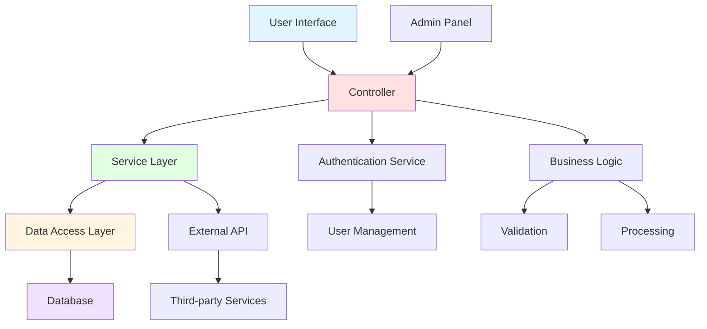

# Component Control Diagram

This diagram shows how all the components are controlled in the system.

## Component Description

- **User Interface**: The front-end layer where users interact with the system
- **Controller**: Manages incoming requests and coordinates responses
- **Service Layer**: Contains business logic and service implementations
- **Data Access Layer**: Handles all database operations
- **Database**: Persistent data storage
- **Authentication Service**: Manages user authentication and authorization
- **User Management**: Handles user-related operations
- **Business Logic**: Core application logic
- **Validation**: Input validation and data verification
- **Processing**: Data processing and transformation
- **External API**: Interface to external services
- **Third-party Services**: External integrations
- **Admin Panel**: Administrative interface for system management

## Notes

This is a placeholder diagram. Please update the connections and components based on the actual system architecture shown in your picture.
