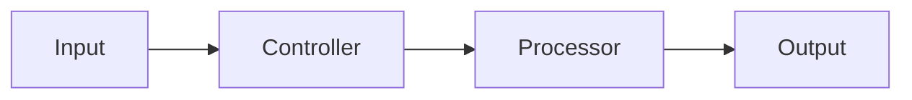
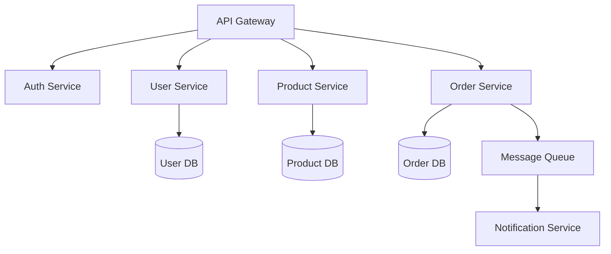
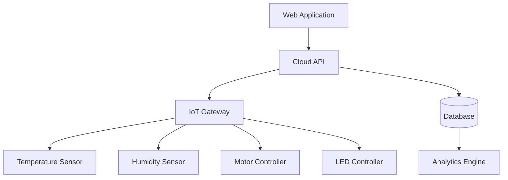
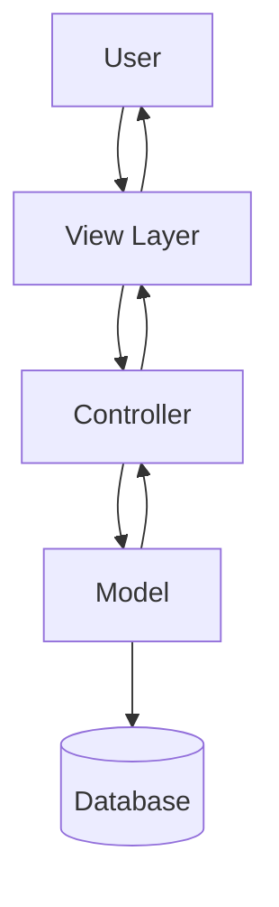
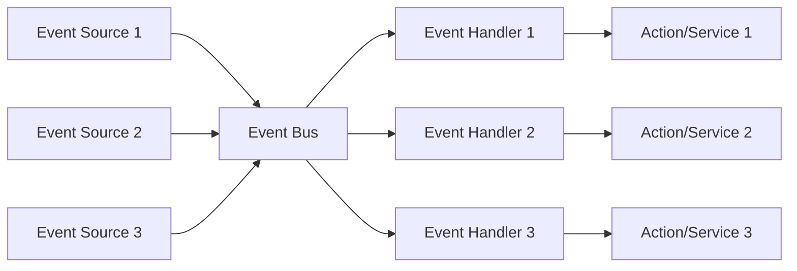
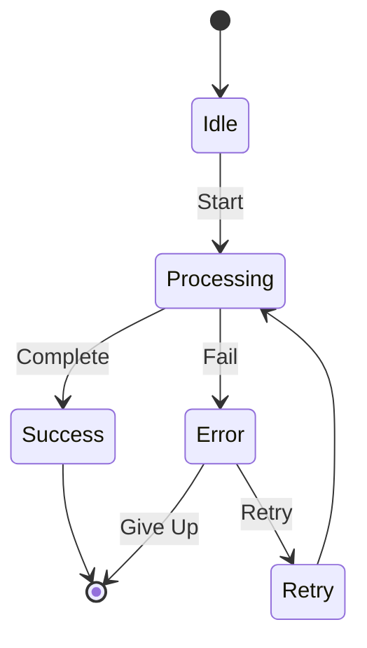
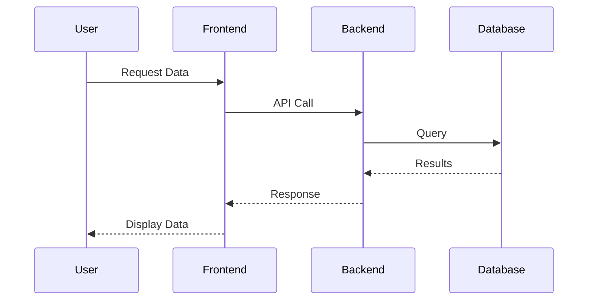

# Alternative Mermaid Diagram Examples

Since the original picture was not available, here are several common diagram patterns you can use. Choose or modify the one that best matches your system architecture.

## Example 1: Simple Control Flow

## Example 2: Microservices Architecture

## Example 3: IoT/Hardware Control System

## Example 4: MVC Pattern

## Example 5: Event-Driven Architecture

## Example 6: State Machine

## Example 7: Sequence Diagram

## How to Use

1. Copy the example that best matches your needs
2. Modify the component names to match your actual system
3. Add or remove connections as needed
4. Update the `component-diagram.md` file with your customized diagram

## Tips for Mermaid Diagrams

- Use `graph TD` for top-down diagrams
- Use `graph LR` for left-right diagrams
- Use `-->` for directional arrows
- Use `---` for non-directional connections
- Use square brackets `[]` for rectangular nodes
- Use parentheses `()` for rounded nodes
- Use cylinder notation `[()]` for databases
- Add colors with `style NodeName fill:#color`
